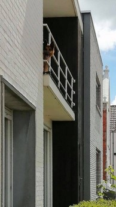

# Fran Andries

> *"The Best Way To Get Started Is To Quit Talking And Begin Doing - Walt Disney"*

## Me, in one sentence.

| |  |
| -------- | ---------- | 
| Birthday | 14/09/1994 |
| Favorite color |  Green| 
| Favorite food|  Sushi| 
| Pineapple on pizza| &#9745; | 

### Hobbies
- Walking with my dog
- Going out with friends
- Make-up
- Sport
    - Bootcamp 
    - Fitness

#### You can always count on me when...
you need help. I will help you or look together for a solution. 

##### A funny story

A funny story that happened recently is about my dog. His name is Charlie and it's a German shepard. When we leave the house, he stays inside. He is an expert at opening doors so sometimes he can be upstairs when I come home. 

We have one room upstairs with a balcony. It was a beautiful day so the window was open in that room. There was also a screen before the window. But one day Charlie decided to go upstairs and destroy the screen to go on the balcony.

So my neighbour from across the street comes outside and sees Charlie on the balcony. She tried to make him go back inside. But the problem was that he had difficulty to go back through the hole he made. I live together with my sister but we both weren't home so my neighbour called my mom and then she went there and got him inside. 

###### TL;DR Dog chillin' on the balcony.

[Previous](https://github.com/Florianbracke/Markdown_challenge) 
-- [Next]()